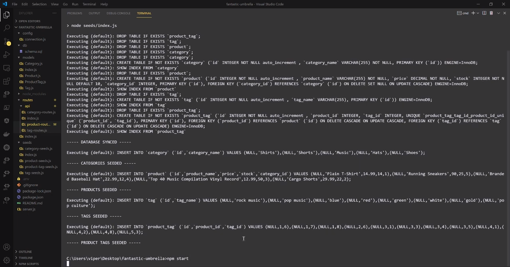
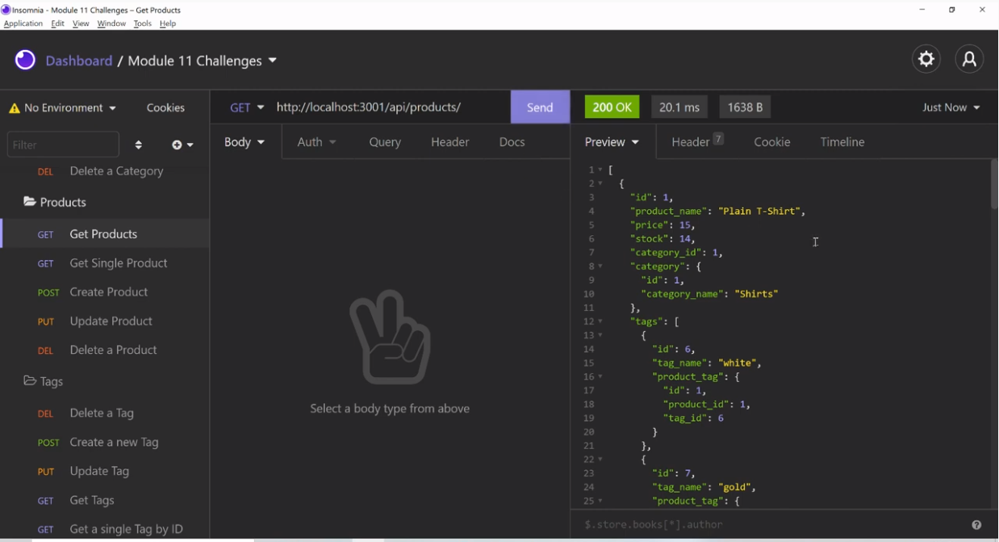

# SQL E-commerce back-end App

## Table of contents 

- [Description](#Description)
- [Technology Used](#Technology-used)
- [Installation](#Installation)
- - [Database](#Database)
- [Pictures](#Pictures)
- [Contributing](#Contributing)
- [Questions](#Questions)

## Description

This is a functioning back end for an E-commerce site.
This application connects to a mySQL database using Express and Sequealize while utilizing RESTful API and CRUD methods.

You can view a quick demo video of it in aciton here: [https://youtu.be/DMVwrCqtCyY](https://youtu.be/DMVwrCqtCyY)

I hope you enjoy using it as much as I enjoyed making it.

## Technology used

- dotenv 8.2.0
- express 4.17.1
- sequelize 5.22.4
- mysql2 2.3.3
- nodemon 2.0.15 (used for testing)

## Installation

You can start by downloading the program from this repository: [https://github.com/JeffGoji/E-commerce-Project](https://github.com/JeffGoji/E-commerce-Project).  
Navigate to your folder you saved the file and run your command terminal and install the following:

- npm install mysql2
- npm install sequelize
- npm install dotenv
- npm install nodemon
  Installation is a process of installing the dependencies required. Intialize node package manager and then run the following commands;

Run "npm start" to start the application and enjoy!

## Pictures

## Contributing

Feel free to contact me about contributing to this project. :)

## Questions

If you have any questions about the repo, open an issue or contact me directly at jeff.lester@outlook.com.
You can find more of my work at [https://github.com/jeffgoji](https://github.com/jeffgoji)

[Back to top](#top)
